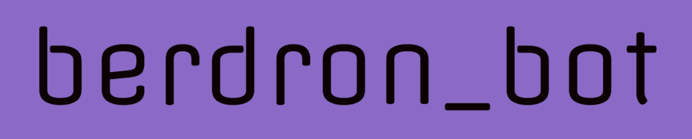
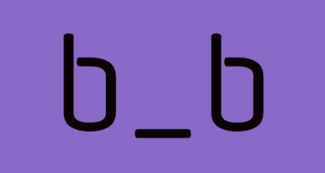
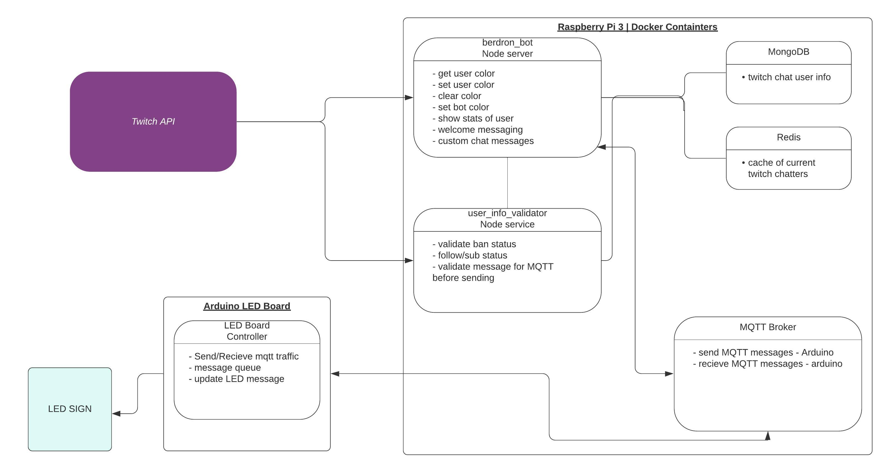

<!-- PROJECT LOGO -->
 

  

  <h3 align="center">berdron_bot</h3>

  

    A custom Twitch chat bot built by <a href"https://twitch.tv/berdron>Berdron</a> for his stream. 
     

  

<!-- TABLE OF CONTENTS -->

  
<h2 style="display: inline-block">Table of Contents</h2>

  <ol>
    <li>
      <a href="#about-the-project">About The Project</a>
      <ul>
        <li><a href="#built-with">Built With</a></li>
      </ul>
    </li>
    <li><a href="#usage">Usage</a></li>
    <li><a href="#roadmap">Roadmap</a></li>
    <li><a href="#contact">Contact</a></li>
  </ol>

 

<!-- ABOUT THE PROJECT -->
## About The Project

Berdron_Bot is a custom chat bot designed for Berdron's unique chatting needs. 

This bot contains a unique mix of practical tools and "because I can" tools. 

The core functionality of the this bot is to run a local service that twitch chat users can interact with me directly.

There are many features that allow for interaction in chat or on the stream overlay, but I wanted to extend the experience to the physical spaces as well. For this, I am creating a series of devices that will be connected and controlled by Berdron_Bot. 

One of the most amusing "because I can" features is how the Raspberry Pi will communicate with all these other devices. A NodeRed docker container will broadcast over a local MQTT network. This is completely unnecessary and therefor exactly what was needed. 

 
 

To keep the bot beeping along and up to date, I will have a local MongoDB container running along side the bot which will be used to store all the info for the bot consume. There will also be a Redis cache container running that will query the MongoDB anytime there is a new chatter in chat. To ensure continuity, I will set up an off-raspi back-up for the MongoDB.

### 🔧  Built With 🔧

* [Node]()
* [Twitch API]()
* [MQTT]()
* [NodeRed]()
* [Docker]()
* [Arduino FastLED]() 

<!-- USAGE EXAMPLES -->
## 🚀 Usage 🚀

Most of the bot commands can be found via `!bbcommands` in twitch chat. I plan to migrate my usages of other bots to the berdron_bot entirely. 

Commands that are being implemented now:
* !bbcommands - send a link to the list of commands, here 
* !setcolor - set the color for yourself in chat
* !getcolor - get the color you have set
* !clearcolor - reset your color -> randomly selected for now
* !set_bot_color - a way to set the color for this Bot, redeemed by channel points
* !aboutbb - get info about the bot, link to here

<!-- ROADMAP -->
## Roadmap

This is the initial tech design I came up with. It will evolve and grow as the bot does.

### TODO 
 * [x] Design and outline scope
 * [x] Bot skeleton
 * [x] Hello world function
 * [x] Get test env running on raspi
 * [ ] Build out functions
   * [ ] get/set colors
   * [ ] get user info
   * [ ] get bot details
   * [ ] welcome message
 * [ ] Build database
   * [ ] database interactions/functions
 * [ ] MQTT set up bot side
 * [ ] MQTT set up arduino side

### Notes:

Message structure:

`tags`:
{
  'badge-info': { subscriber: '1' },

  badges: { moderator: '1', subscriber: '0' },

  'client-nonce': 'some-nonce',

  color: '#00FF7F',

  'display-name': 'berdron_bot',

  emotes: null,

  flags: null,

  id: '542a8329-12b5-477a-b91c-e1a681dd643b',

  mod: true,

  'room-id': '',

  subscriber: true,

  'tmi-sent-ts': '',

  turbo: false,

  'user-id': '',

  'user-type': 'mod',

  'emotes-raw': null,

  'badge-info-raw': 'subscriber/1',

  'badges-raw': 'moderator/1,subscriber/0',

  username: 'berdron_bot',

  'message-type': 'chat'
}

<!-- CONTRIBUTING -->
## Contributing

Contributions are what make the open source community such an amazing place to be learn, inspire, and create. Any contributions you make are **greatly appreciated**.

1. Fork the Project
2. Create your Feature Branch (`git checkout -b feature/AmazingFeature`)
3. Commit your Changes (`git commit -m 'Add some AmazingFeature'`)
4. Push to the Branch (`git push origin feature/AmazingFeature`)
5. Open a Pull Request

<!-- CONTACT -->
## Contact

[Berdron](https://twitch.tv/berdron) - [GitHub](https://github.com/scott-olson)

Project Link: [https://github.com/scott-olson/berdron_bot](https://github.com/scott-olson/berdron_bot)

